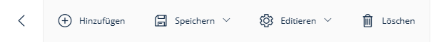

# AddNewToolbarAction

Die `AddNewToolbarAction` ist eine benutzerdefinierte JavaScript-Toolbar-Aktion, die vom `SuluAdminExtrasBundle` bereitgestellt wird. Sie ermöglicht es, einen "Neu" Button zur Toolbar in Sulu Admin Edit- oder Settings-Formularen hinzuzufügen. Bei Klick wird der Benutzer direkt zur "Add" ("Hinzufügen") Route des jeweiligen Moduls weitergeleitet.

Dies ist besonders nützlich, um die Dateneingabe zu beschleunigen, da Benutzer fortlaufend neue Datensätze anlegen können, ohne zwischendurch in die Listenansicht zurückkehren zu müssen.



## Features

- Weiterleitung zu einer beliebigen angegebenen Route (meistens die `add_form` Route).
- Optionales Vorausfüllen des `date` Attributs mit dem tagesaktuellen Datum (nützlich für Kalendereinträge oder Termine).
- Beibehaltung der aktuell ausgewählten Sprache (`locale`) bei der Weiterleitung.

## Verwendung

Die `sulu_admin_extras.add_new` Toolbar-Aktion kann nativ in jeder Admin PHP-Klassen genutzt werden, in denen eine Formular-View konfiguriert wird.

### Standardbeispiel (Ressourcen)

Die Aktion wird einfach in das Array `$toolbarActions` des Form View Builders eingefügt und die Zielroute angegeben.

```php
use Sulu\Bundle\AdminBundle\Admin\View\ToolbarAction;

// ... innerhalb der Admin::configureViews() ...

$detailsToolbarActions = [
    new ToolbarAction('sulu_admin_extras.add_new', [
        'route' => static::ADD_FORM_VIEW
    ]),
    new ToolbarAction('sulu_admin.save'),
];
```

### Datum vorausfüllen (Termine)

Wenn die "Hinzufügen"-Route einen `date` Parameter unterstützt (z.B. um das heutige Datum in einem Kalender oder Datepicker vorzuselektieren), kann die Option `'passDate' => true` verwendet werden.

```php
use Sulu\Bundle\AdminBundle\Admin\View\ToolbarAction;

// ... innerhalb der Admin::configureViews() ...

$detailsToolbarActions = [
    new ToolbarAction('sulu_admin_extras.add_new', [
        'route' => static::ADD_FORM_VIEW,
        'passDate' => true,
    ]),
    new ToolbarAction('sulu_admin.save'),
];
```

Bei Klick wechselt der Router dann in die `ADD_FORM_VIEW` Route und hängt automatisch die Parameter `&date=YYYY-MM-DD` sowie `&locale={aktuelle_sprache}` an die URL an.
