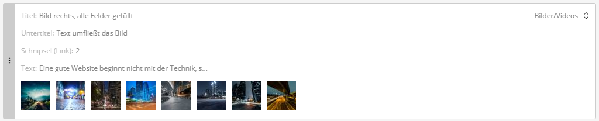

# Block-Vorschau

Mit diesem Bundle wird die Vorschau zugeklappter Blöcke in `block`-Feldern erweitert. Der Sulu-Core zeigt dort nur Text-, Select-, Datums-, Smart-Content- und Medienfelder an. Alle anderen Felder mit dem Tag `sulu.block_preview` werden stillschweigend ignoriert, sodass Blöcke rund um einen Kontakt, eine Organisation, ein Formular, einen Link oder eine verschachtelte Liste zugeklappt leer wirken. Das Bundle ergänzt die fehlenden Darstellungen, stellt jeder Zeile die Bezeichnung des Feldes in hellem Grau voran und meldet einen fehlenden Titel mit „Ohne Titel“.



---

## Verwendung im Formular-XML

Die Darstellungen werden automatisch registriert; es muss nur das Feld mit dem Tag versehen werden. Bei einem verschachtelten `block`-Feld steht der Tag direkt vor `<types>`.

```xml
<property name="contact" type="single_contact_selection">
    <meta>
        <title lang="de">Person</title>
        <title lang="en">Person</title>
    </meta>
    <tag name="sulu.block_preview" priority="1280"/>
</property>

<block name="boxes" default-type="types-box">
    <tag name="sulu.block_preview" priority="1280"/>
    <types>
        <type ref="types-box"/>
    </types>
</block>
```

---

## Prioritäten

Die Zeilen sind nach `priority` sortiert, höchste zuerst. Ein bewährtes Schema für ein einheitliches Bild über alle Blöcke:

| Priorität | Inhalt |
|-----------|--------|
| `2048` | Titel |
| `1536` | Untertitel |
| `1280` | Das Besondere des Blocks (Auswahl, Link, verschachtelte Liste, ...) |
| `768` | Textauszug |
| `512` | Vorschaubild |

---

## Darstellungen

| Feldtyp | Zeigt |
|---------|-------|
| `single_account_selection`, `single_contact_selection`, `single_snippet_selection`, `single_form_selection` | `Organisation: Muster GmbH` (der Name wird bei Bedarf geladen und 30 Sekunden zwischengespeichert) |
| `account_selection`, `contact_account_selection`, `snippet_selection`, `page_selection`, `article_selection`, `event_selection`, `testimonial_selection`, `teaser_selection` | `Seiten: 3` |
| `snippet_selection`, `single_snippet_selection` | Zusätzlich der Titel des erlaubten Snippet-Typs aus dem `types`-Param des Feldes, z. B. `Schnipsel (Link): 2` (der Titel stammt aus `<meta><title>` des Snippet-Templates) |
| `block` (verschachtelt) | `Einträge: 3 - Titel A, Titel B, Ohne Titel` (erstes `title`/`name`/`headline` jedes Eintrags, „Ohne Titel“, wenn keines gesetzt ist) |
| `link` | Die Adresse bei externen Links, die Art (Seite, Medium, ...) bei internen |

Bereits registrierte Schlüssel werden nie ersetzt; eine Darstellung aus dem Sulu-Core hat also immer Vorrang.

---

## Beschriftungen und fehlender Titel

Jede Vorschau-Zeile beginnt mit der Bezeichnung ihres Feldes in hellem Grau (`Titel: ...`, `Untertitel: ...`, `Organisation: ...`). Bei Core-Feldern ist das der `<meta><title>` des Feldes; die Darstellungen oben bringen eine eigene, kürzere Bezeichnung mit. Vorschaubilder von Medienfeldern bleiben ohne Bezeichnung.

Zeigt ein Block ein Titelfeld in der Vorschau (`title`, `name` oder `headline` trägt den Tag), der Redakteur hat es aber leer gelassen, lautet die erste Zeile `Titel: Ohne Titel`, statt dass die Zeile einfach fehlt.

Das übernimmt eine eigene Variante des `block`-Feldtyps im Bundle, die den von Sulu im Feld-Register ersetzt (gleiche Technik wie bei [Icon Selection](icon_selection.de.md)). Ansonsten verhalten sich zugeklappte Blöcke exakt wie im Core.

---

## Hinweise

- Ein getaggtes Feld erscheint nur, solange es einen Wert hat. Felder, die per `visibleCondition` ausgeblendet werden, sollten nicht getaggt werden: Sulu behält den Wert versteckter Felder, der zugeklappte Block würde veraltete Angaben zeigen.
- Die Vorschau sieht keine Nachbarfelder und kann daher z. B. „Art“ und „Auswahl“ nicht kombinieren.
- Die Beschriftungen lassen sich über die Übersetzungsschlüssel `sulu_admin_extras.block_preview_*` anpassen.

---

## Komponenten

| Datei | Beschreibung |
|-------|--------------|
| `LabeledFieldBlocks.js` | Variante des `block`-Feldtyps mit beschrifteten Zeilen und „Ohne Titel“ |
| `SingleSelectionBlockPreviewTransformer.js` | Name der Auswahl bei Organisation, Kontakt, Snippet und Formular |
| `SelectionBlockPreviewTransformer.js` | Anzahl bei Mehrfach-Auswahlen |
| `BlockListBlockPreviewTransformer.js` | Anzahl und Titel verschachtelter Blöcke |
| `LinkBlockPreviewTransformer.js` | Adresse bzw. Art eines Links |
