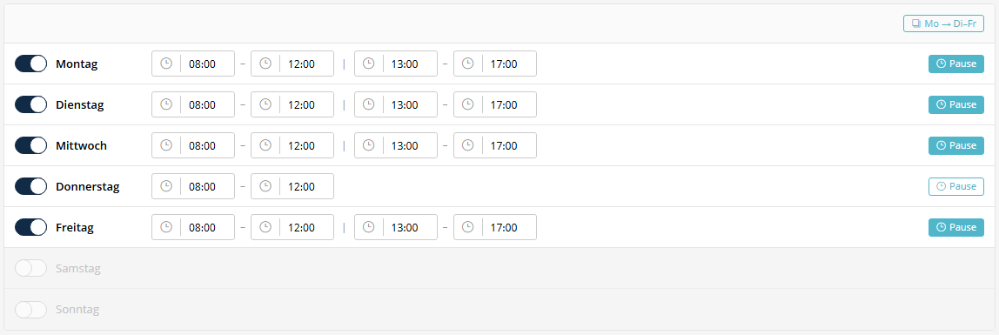

# Business Hours

A compact weekly schedule editor that replaces multiple individual time fields with a single JSON-based field. Users can enable/disable days, set time slots, toggle breaks, and copy Monday's schedule to all weekdays.



---

## Usage in XML Forms

```xml
<property name="businessHours" type="business_hours" colspan="12">
    <meta>
        <title lang="de">Arbeitszeiten</title>
        <title lang="en">Business Hours</title>
    </meta>
</property>
```

---

## Features

- **Toggle per day**: Enable or disable individual weekdays via Sulu Toggler
- **Time slots**: Sulu DatePicker (time-only mode, `HH:mm` format) for start and end times
- **Break toggle**: Split a day into two slots (morning/afternoon) or merge into a continuous block
- **Copy function**: "Mon → Tue–Fri" button copies Monday's configuration to all other weekdays
- **Translations**: All labels use `translate()` via `admin.de.yaml` / `admin.en.yaml`

---

## Data Structure (JSON)

The field stores a JSON object with one entry per weekday:

```json
{
    "monday": {
        "enabled": true,
        "break": true,
        "slots": [
            {"start": "08:00", "end": "12:00"},
            {"start": "13:00", "end": "17:00"}
        ]
    },
    "tuesday": {
        "enabled": true,
        "break": false,
        "slots": [
            {"start": "08:00", "end": "17:00"}
        ]
    },
    "saturday": {
        "enabled": false,
        "break": false,
        "slots": []
    }
}
```

| Key | Type | Description |
|-----|------|-------------|
| `enabled` | `boolean` | Whether the day is a working day |
| `break` | `boolean` | Whether the day has a lunch break (2 slots vs 1) |
| `slots` | `array` | Array of `{start, end}` objects in `HH:mm` format |

---

## Default Values

When no value is stored, weekdays (Mon–Fri) default to `08:00–12:00 / 13:00–17:00` with break enabled. Saturday and Sunday are disabled.

---

## PHP Access

```php
$businessHours = $settings->getBusinessHours();

// Get slots for a specific day
$monday = $businessHours['monday'] ?? null;
if ($monday && $monday['enabled']) {
    foreach ($monday['slots'] as $slot) {
        $start = $slot['start']; // "08:00"
        $end = $slot['end'];     // "12:00"
    }
}
```

---

## Components

| File | Description |
|------|-------------|
| `BusinessHours.js` | FieldType wrapper |
| `BusinessHoursEditor.js` | Interactive editor component |
| `BusinessHours.scss` | Styles (Sulu color variables) |
| `BusinessHoursPropertyResolver.php` | Content API resolver |