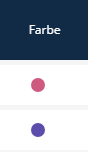

# Color Dot

Ein einfacher Listen-Feld-Transformer, der einen farbigen Kreis (Punkt) in Listenansichten darstellt. Er nimmt einen Hex-Farbwert aus dem Feld und zeigt ihn als 18×18px Kreis an. Nützlich für schnelle visuelle Zuordnung in Tabellen, z.B. für Kategorien, Status oder Tags.



---

## Verwendung in Listen-XML

```xml
<property name="color" visibility="always" translation="app.color">
    <tag name="sulu_admin.list_field_transformer" type="color_dot"/>
</property>
```

---

## Funktionen

- **Farbkreis**: Rendert einen runden Punkt mit dem Feldwert als `backgroundColor`
- **Tooltip**: Zeigt den Hex-Farbwert beim Hover
- **Fallback**: Verwendet `#cccccc` (Hellgrau) wenn der Feldwert leer ist
- **Keine Konfiguration nötig**: Keine Parameter, keine Config — einfach registrieren und verwenden

---

## Funktionsweise

Der Transformer liest den rohen Feldwert (erwartet wird ein CSS-Farbstring wie `#ff5500` oder `rgb(...)`) und rendert:

```html
<div class="typeDot" style="background-color: #ff5500" title="#ff5500" />
```

Der Punkt ist gestylt als:
- 18×18px Kreis (`border-radius: 50%`)
- 2px weißer Rand für Kontrast
- Inline-Block mit vertical-align: middle

---

## Vergleich mit Type Color

| Feature | `color_dot` | `type_color` |
|---------|-------------|--------------|
| Input | Roher Farbwert (`#hex`) | Palette-Key oder Backend-angereichertes Datum |
| Konfiguration | Keine | Palette-Config über `sulu_admin_extras.yaml` |
| Label | Nein | Optional (`show_name`-Parameter) |
| Anwendungsfall | Einfache Farbanzeige | Kategorisierte Farbe mit Name |

`color_dot` verwenden, wenn das Datenbankfeld bereits einen CSS-Farbwert enthält. `type_color` verwenden, wenn Palette-Lookup oder Label-Anzeige benötigt wird.

---

## Entity-Beispiel

```php
#[ORM\Column(type: 'string', length: 7, nullable: true)]
private ?string $color = '#3788d8';

public function getColor(): ?string
{
    return $this->color;
}
```

---

## Styling

Der Transformer nutzt `TypeColorFieldTransformer.scss`:

```scss
.typeDot {
    width: 18px;
    height: 18px;
    border-radius: 50%;
    display: inline-block;
    vertical-align: middle;
    border: 2px solid $white;
}
```

---

## Komponenten

| Datei | Beschreibung |
|-------|--------------|
| `ColorDotFieldTransformer.js` | Transformer-Klasse mit `transform(value, parameters)` |
| `TypeColorFieldTransformer.scss` | Geteilte Styles (`.typeDot`) |