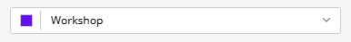
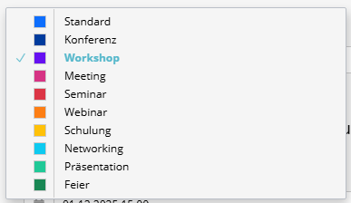

# Color Select

The **Color Select** Content Type allows users to select a color from a dropdown list. The dropdown shows a visual preview of each color (the hex code) alongside its name.





---

## Usage (Form XML)

Use the `color_select` type. It requires a list of `values` (options). You can manually provide these options or, more conveniently, fetch them from the `ColorPaletteProvider`.

```xml
<property name="theme_color" type="color_select">
    <meta>
        <title lang="en">Theme Color</title>
        <title lang="de">Themenfarbe</title>
    </meta>
    <params>
        <!-- Option 1: fetch from ColorPaletteProvider (recommended) -->
        <param name="values" type="expression"
               value="service('sulu_admin_extras.color_palette_provider').getValues('bootstrap')"/>
        
        <param name="default_value" type="expression"
               value="service('sulu_admin_extras.color_palette_provider').getDefaultValue('bootstrap')"/>
    </params>
</property>
```

---

## Color Palettes Configuration

You can define your own palettes in `config/packages/sulu_admin_extras.yaml`. These can then be accessed via `getValues('palette_name')`.

```yaml
sulu_admin_extras:
    color_palettes:
        # Simple definition (Key: Hex)
        my_scheme:
            primary: '#0055ff'
            secondary: '#aabbcc'
            
        # Extended definition (Key: {color, name})
        status:
            active:
                color: '#00ff00'
                name: 'app.status.active' # Translation key
```
