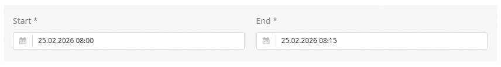
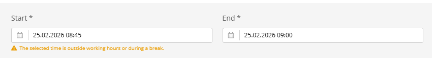
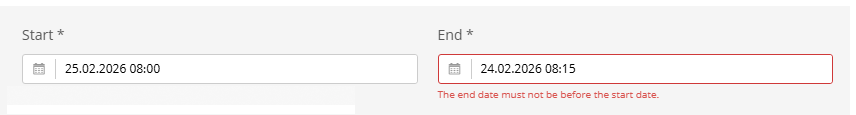

# DateTime Start / End

A linked pair of date-time pickers designed for scheduling scenarios. `datetime_start` can auto-calculate the end time, validate against business hours, and find the next available slot. `datetime_end` validates that it is not before the start time.

Both extend `AbstractDateTime`, which provides a Sulu DatePicker with date + time format and support for `default_value` via `schemaOptions`.





---

## Usage in XML Forms

```xml
<property name="start" type="datetime_start" mandatory="true" colspan="6">
    <meta>
        <title lang="de">Start</title>
        <title lang="en">Start</title>
    </meta>
    <params>
        <param name="step" value="15"/>
        <param name="end_date_field" value="end"/>
        <param name="default_duration" value="15"/>
        <param name="auto_update" value="always"/>
        <param name="defaults_api_url" value="/admin/api/appointment-settings/defaults"/>
        <param name="validate_time_url" value="/admin/api/appointment-settings/validate-time"/>
    </params>
</property>

<property name="end" type="datetime_end" mandatory="true" colspan="6">
    <meta>
        <title lang="de">Ende</title>
        <title lang="en">End</title>
    </meta>
    <params>
        <param name="step" value="15"/>
        <param name="start_date_field" value="start"/>
    </params>
</property>
```

---

## Features

### datetime_start

- **Auto end-time**: When the start is changed, the end field is automatically set to `start + default_duration`
- **Business hours validation**: If `defaults_api_url` and `validate_time_url` are set, loads default times and validates against configured business hours via API endpoints
- **Next available slot**: On initial load (no value), automatically finds the next available time slot within business hours
- **Minute stepping**: Configurable via `step` param (default: 15 minutes)
- **Warning display**: Shows a yellow warning if the selected time falls outside business hours

### datetime_end

- **Start validation**: Compares against the linked start field and shows an error if end is before start
- **Minute stepping**: Configurable via `step` param (default: 1 minute)
- **Error message**: Displays a red error message using `translate('sulu_admin_extras.errors.start_after_end')`

---

## Schema Options

### datetime_start

| Param | Type | Default | Description |
|-------|------|---------|-------------|
| `step` | `integer` | `15` | Minute stepping for the time picker |
| `end_date_field` | `string` | `'end'` | Name of the end date field to auto-update |
| `default_duration` | `integer` | `15` | Duration in minutes to add for auto end-time |
| `auto_update` | `string` | `'always'` | When to auto-update: `'always'`, `'initial'` (only if end is empty), `'never'` |
| `defaults_api_url` | `string` | — | API endpoint URL for loading default start/end times |
| `validate_time_url` | `string` | — | API endpoint URL for validating time slots, returns `{valid: boolean, strict: boolean}` |
| `default_value` | `string` | — | Default datetime in `YYYY-MM-DDTHH:mm:ss` format (inherited from AbstractDateTime) |

### datetime_end

| Param | Type | Default | Description |
|-------|------|---------|-------------|
| `step` | `integer` | `1` | Minute stepping for the time picker |
| `start_date_field` | `string` | `'start'` | Name of the start date field for validation |
| `default_value` | `string` | — | Default datetime in `YYYY-MM-DDTHH:mm:ss` format (inherited from AbstractDateTime) |

---

## Data Format

Both fields store their value as an ISO string:

```
2026-03-15T14:30:00
```

Format: `YYYY-MM-DDTHH:mm:ss`

---

## Business Hours Validation (datetime_start)

When `defaults_api_url` and `validate_time_url` are configured, the component:

1. Loads default start/end times via `defaults_api_url`
2. Validates the selected time by calling `validate_time_url`, which returns `{valid: boolean, strict: boolean}`
3. Shows a yellow warning if the selected time is outside business hours (non-strict) or a red error (strict)
4. On initial load, calls `findNextAvailableSlot()` to auto-select the next valid time within a 7-day window

---

## Components

| File | Description |
|------|-------------|
| `AbstractDateTime.js` | Base class with DatePicker, default value handling, and `afterChange()` hook |
| `DateTimeStart.js` | Extends AbstractDateTime with business hours validation and auto end-time |
| `DateTimeEnd.js` | Extends AbstractDateTime with start-before-end validation |