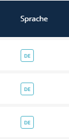

# Ghost Locale Indicator (Sprachstatus)

Der **Ghost Locale Indicator** ist ein List Transformer, der visualisiert, ob Inhalt in der aktuellen Sprache existiert oder ob es sich um einen "Ghost" (Fallback aus einer anderen Sprache) handelt.



---

## Verwendung (Listen XML)

```xml
<property name="ghostLocale" translation="sulu_admin.ghost_locale" visibility="yes">
    <transformer type="ghost_locale_indicator"/>
</property>
```

Dies wird oft in Kombination mit der Standard-Eigenschaft `ghost_locale` verwendet, die von Sulus Persistenzlogik bereitgestellt wird.

---

## Parameter

Dieser Transformer akzeptiert keine XML-Parameter.
