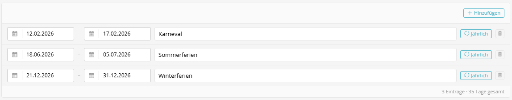

# Holiday Dates

A date range manager for company holidays, bridge days, and other closure periods. Supports recurring annual periods (e.g. "Christmas shutdown every year") and calculates total day counts automatically.



---

## Usage in XML Forms

```xml
<property name="holidayDates" type="holiday_dates" colspan="12">
    <meta>
        <title lang="de">Betriebsferien &amp; Sonderzeiten</title>
        <title lang="en">Company Holidays &amp; Special Periods</title>
    </meta>
</property>
```

---

## Features

- **Date range entries**: Start and end date via Sulu DatePicker
- **Label**: Free-text description for each period
- **Recurring toggle**: Mark periods as annually recurring (month-day comparison)
- **Day counter**: Automatic total of entries and days in the footer
- **Add/remove**: Dynamic list with add/remove buttons using Sulu Icon components
- **Translations**: All labels use `translate()` via `admin.de.yaml` / `admin.en.yaml`

---

## Data Structure (JSON)

The field stores an array of period objects:

```json
[
    {
        "start": "2026-12-23",
        "end": "2027-01-02",
        "label": "Christmas Shutdown",
        "recurring": true
    },
    {
        "start": "2026-05-15",
        "end": "2026-05-15",
        "label": "Bridge Day (Ascension)",
        "recurring": false
    }
]
```

| Key | Type | Description |
|-----|------|-------------|
| `start` | `string` | Start date in `YYYY-MM-DD` format |
| `end` | `string` | End date in `YYYY-MM-DD` format |
| `label` | `string` | Description of the period |
| `recurring` | `boolean` | Whether the period recurs annually |

---

## Recurring Periods

When `recurring` is `true`, the year portion of the dates is ignored. The check uses **month-day comparison** only:

```php
// A date falls within a recurring period if:
$dateMd = $date->format('m-d');       // e.g. "12-25"
$startMd = substr($start, 5);         // e.g. "12-23"
$endMd = substr($end, 5);             // e.g. "01-02"

if ($dateMd >= $startMd && $dateMd <= $endMd) {
    // Non-working day
}
```

> **Note**: Cross-year recurring periods (e.g. Dec 23 – Jan 2) require special handling in the backend. The simple month-day comparison works for periods within a single calendar year.

---

## PHP Access

```php
$holidayDates = $settings->getHolidayDates();

foreach ($holidayDates as $period) {
    $start = $period['start'];        // "2026-12-23"
    $end = $period['end'];            // "2027-01-02"
    $label = $period['label'];        // "Christmas Shutdown"
    $recurring = $period['recurring']; // true
}
```

---

## Required Translations

| Key | DE | EN |
|-----|----|----|
| `sulu_admin_extras.holiday_dates.title` | Betriebsferien | Company Holidays |
| `sulu_admin_extras.holiday_dates.add` | Hinzufügen | Add |
| `sulu_admin_extras.holiday_dates.empty` | Keine Betriebsferien eingetragen. | No company holidays defined. |
| `sulu_admin_extras.holiday_dates.label_placeholder` | Bezeichnung... | Label... |
| `sulu_admin_extras.holiday_dates.recurring` | Jährlich | Annual |
| `sulu_admin_extras.holiday_dates.recurring_title` | Jährlich wiederkehrend | Recurring annually |
| `sulu_admin_extras.holiday_dates.entries` | Einträge | entries |
| `sulu_admin_extras.holiday_dates.days_total` | Tage gesamt | days total |

---

## Components

| File | Description |
|------|-------------|
| `HolidayDates.js` | FieldType wrapper |
| `HolidayDatesEditor.js` | Interactive editor with date ranges |
| `HolidayDates.scss` | Styles (Sulu color variables) |
| `HolidayDatesPropertyResolver.php` | Content API resolver |