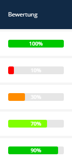
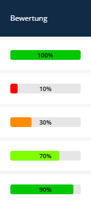
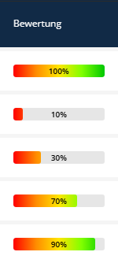
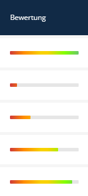
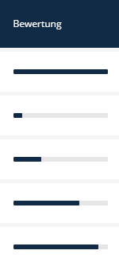

# Percent Bar (Fortschrittsbalken)

Der **Percent Bar** ist ein List Transformer, der einen numerischen Wert (0-100) als Fortschrittsbalken in der Listenansicht visualisiert.







---

## Verwendung (Listen XML)

```xml
<property name="progress" translation="app.progress" visibility="yes">
    <transformer type="percent_bar">
        <params>
            <param name="max_value" value="100"/>
            <param name="show_value" value="true"/>
            <param name="use_gradient" value="true"/>
        </params>
    </transformer>
</property>
```

---

## Parameter

| Name             | Typ     | Standard    | Beschreibung |
|------------------|---------|-------------|--------------|
| `max_value`      | Integer | `100`       | Der Wert, der als 100% betrachtet wird. |
| `show_value`     | Boolean | `true`      | Zeigt den Prozentsatz als Text an (z.B. "75%"). |
| `value_position` | String  | `'outside'` | `'inside'` (im Balken) oder `'outside'` (daneben). |
| `height`         | Integer | `16`        | Höhe des Balkens in Pixeln. |
| `use_gradient`   | Boolean | `true`      | Verwendet einen Farbverlauf (Rot zu Grün). |
| `color`          | Hex     | `#52b6ca`   | Farbe, falls kein Verlauf verwendet wird. |
| `animate`        | Boolean | `true`      | Animiert die Breite beim Laden. |

---

## Globale Konfiguration

Standardwerte können in `config/packages/sulu_admin_extras.yaml` gesetzt werden:

```yaml
sulu_admin_extras:
    percent_bar:
        show_value: true
        height: 16
        use_gradient: true
```