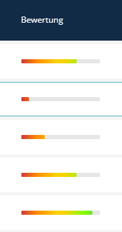

# Percent Bar

The **Percent Bar** is a List Transformer that visualizes a numeric value (0-100) as a progress bar in the administration list view.



---

## Usage (List XML)

```xml
<property name="progress" translation="app.progress" visibility="yes">
    <transformer type="percent_bar">
        <params>
            <param name="max_value" value="100"/>
            <param name="show_value" value="true"/>
            <param name="use_gradient" value="true"/>
        </params>
    </transformer>
</property>
```

---

## Parameters

| Name             | Type    | Default     | Description |
|------------------|---------|-------------|-------------|
| `max_value`      | integer | `100`       | Value considered as 100%. |
| `show_value`     | boolean | `true`      | Displays the percentage text (e.g., "75%"). |
| `value_position` | string  | `'outside'` | `'inside'` (in the bar) or `'outside'` (next to it). |
| `height`         | integer | `16`        | Height of the bar in pixels. |
| `use_gradient`   | boolean | `true`      | Applies a color gradient (red to green). |
| `color`          | hex     | `#52b6ca`   | Fallback color if gradient is disabled. |
| `animate`        | boolean | `true`      | Animates the bar width on load. |

---

## Global Configuration

Defaults can be set in `config/packages/sulu_admin_extras.yaml`:

```yaml
sulu_admin_extras:
    percent_bar:
        show_value: true
        height: 16
        use_gradient: true
```