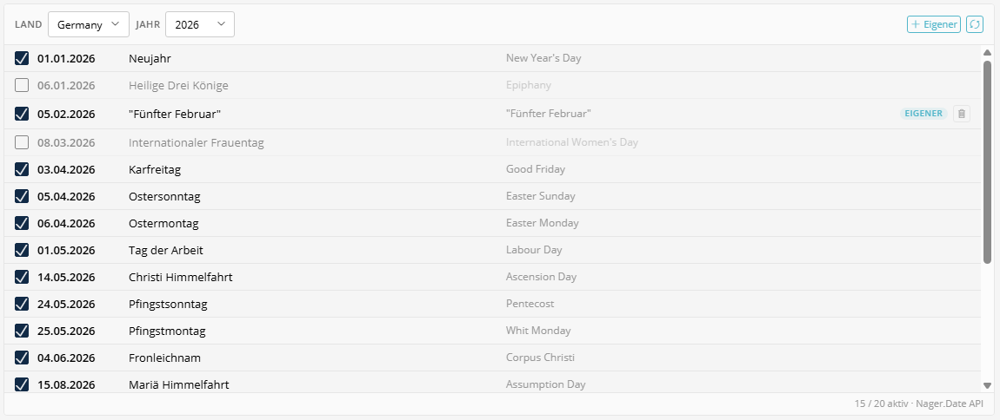

# Public Holidays

Ein interaktiver Feiertags-Manager, der gesetzliche Feiertage über die [Nager.Date API](https://date.nager.at/) abruft – mit Land- und Regions-Filterung. Einzelne Feiertage können aktiviert/deaktiviert, eigene Einträge hinzugefügt und das Jahr gewählt werden.



---

## Verwendung in XML-Formularen

```xml
<property name="publicHolidays" type="public_holidays" colspan="12">
    <meta>
        <title lang="de">Feiertage</title>
        <title lang="en">Holidays</title>
    </meta>
</property>
```

---

## Funktionen

- **Land- & Regionswahl**: Sulu SingleSelect für Land und optionale Unterteilung (z.B. NRW, Bayern)
- **Jahresauswahl**: Aktuelles Jahr ±1, mit Option auf +2 Jahre voraus
- **API-Integration**: Feiertage von Nager.Date API über serverseitigen Proxy mit 24h-Cache
- **Checkbox pro Feiertag**: Einzelne Feiertage über Sulu-Checkbox aktivieren/deaktivieren
- **Eigene Feiertage**: Eigene Einträge mit Sulu-DatePicker und Freitext-Name hinzufügen
- **Zähler**: Zeigt aktive/gesamt-Anzahl in der Fußzeile
- **Übersetzungen**: Alle Beschriftungen über `translate()` via `admin.de.yaml` / `admin.en.yaml`

---

## Datenstruktur (JSON)

```json
{
    "country": "DE",
    "subdivision": "DE-NW",
    "year": 2026,
    "holidays": [
        {
            "date": "2026-01-01",
            "localName": "Neujahr",
            "name": "New Year's Day",
            "enabled": true,
            "custom": false
        },
        {
            "date": "2026-02-11",
            "localName": "Teamtag",
            "name": "Teamtag",
            "enabled": true,
            "custom": true
        }
    ]
}
```

| Schlüssel | Typ | Beschreibung |
|-----------|-----|--------------|
| `country` | `string` | ISO-Ländercode (z.B. `DE`, `AT`, `CH`) |
| `subdivision` | `string\|null` | Regionaler Code (z.B. `DE-NW` für NRW) oder `null` für alle |
| `year` | `integer` | Ausgewähltes Jahr |
| `holidays` | `array` | Array von Feiertags-Objekten |
| `holidays[].date` | `string` | Datum im Format `YYYY-MM-DD` |
| `holidays[].localName` | `string` | Lokaler Name des Feiertags |
| `holidays[].name` | `string` | Internationaler (englischer) Name |
| `holidays[].enabled` | `boolean` | Ob dieser Feiertag aktiv ist |
| `holidays[].custom` | `boolean` | Ob manuell hinzugefügt |

---

## Serverseitige Komponenten

### PublicHolidayProxyController

Stellt drei API-Endpunkte für das Frontend bereit:

| Route | Methode | Beschreibung |
|-------|---------|--------------|
| `/admin/api/public-holidays/countries` | GET | Verfügbare Länder |
| `/admin/api/public-holidays/subdivisions/{code}` | GET | Regionen eines Landes |
| `/admin/api/public-holidays/fetch?country=DE&year=2026` | GET | Feiertage für Land/Jahr |

### PublicHolidayService

Symfony-Service, der die Nager.Date API mit Caching kapselt:

- Ruft Daten von `https://date.nager.at/api/v3/` ab
- Cacht Antworten für 24 Stunden (Länder 7 Tage, Regionen 30 Tage)
- Filtert nach Unterteilung wenn angegeben
- **Optionale Länder-Filterung** über den Parameter `$allowedCountries`

---

## Länder-Filterung

Um das Länder-Dropdown einzuschränken, den Service in `services.yaml` konfigurieren:

```yaml
Manuxi\SuluAdminExtrasBundle\Service\PublicHolidayService:
    arguments:
        $httpClient: '@http_client'
        $cache: '@cache.app'
        $logger: '@?logger'
        $allowedCountries: ['DE', 'AT', 'CH', 'FR', 'NL', 'BE', 'LU', 'PL', 'CZ', 'DK']
```

Auf `[]` (leeres Array) setzen, um alle 100+ Länder anzuzeigen.

---

## PHP-Zugriff

```php
$publicHolidays = $settings->getPublicHolidays();

// Prüfen ob ein Datum ein Feiertag ist
$dateStr = '2026-01-01';
$holidays = $publicHolidays['holidays'] ?? [];
foreach ($holidays as $holiday) {
    if ($holiday['enabled'] && $holiday['date'] === $dateStr) {
        // Kein Arbeitstag
    }
}
```

---

## Komponenten

| Datei | Beschreibung |
|-------|--------------|
| `PublicHolidays.js` | FieldType-Wrapper |
| `PublicHolidaysEditor.js` | Interaktiver Editor mit API-Integration |
| `PublicHolidays.scss` | Styles (Sulu-Farbvariablen) |
| `PublicHolidaysPropertyResolver.php` | Content-API-Resolver |
| `PublicHolidayService.php` | Nager.Date API-Client mit Caching |
| `PublicHolidayProxyController.php` | Admin-API-Proxy-Endpunkte |