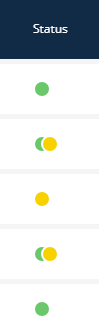

# Publish State Indicator (Statusanzeige)

Der **Publish State Indicator** ist ein List Transformer, der den Workflow-Status einer Entität (z.B. Entwurf vs. Veröffentlicht) mittels eines farbigen Punktes darstellt.



---

## Verwendung (Listen XML)

Er wird typischerweise mit einer Eigenschaft wie `publishedState` verbunden.

```xml
<property name="publishedState" translation="sulu_admin.state" visibility="yes">
    <transformer type="publish_state_indicator"/>
</property>
```

---

## Parameter

Dieser Transformer akzeptiert keine XML-Parameter.

## Anpassung

Die Farben und Logik entsprechen dem Sulu-Standard (Gelb für Entwurf, Grün für Veröffentlicht).
