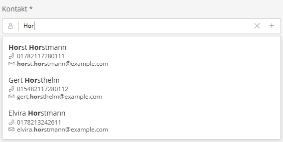

# Single Contact Autocomplete

Ein Autocomplete-Feld für die Auswahl eines einzelnen Kontakts (oder einer anderen Ressource). Bietet eine Suchfunktion mit Dropdown-Vorschlägen, ein Overlay für die detaillierte Listen-Auswahl und eine Schnellerfassungs-Funktion (Quick-Create) für neue Kontakte.



---

## Verwendung in XML-Formularen

```xml
<property name="contact" type="single_contact_autocomplete" colspan="6">
    <meta>
        <title lang="de">Kontakt</title>
        <title lang="en">Contact</title>
    </meta>
    <params>
        <param name="resource_key" value="contacts"/>
        <param name="display_property" value="fullName"/>
    </params>
</property>
```

---

## Funktionen

- **Autocomplete-Suche**: Ab 3 Zeichen wird eine Suche über die API gestartet (`searchStore`). Treffer werden in einem Popover mit optischer Hervorhebung des Suchbegriffs angezeigt (Name, E-Mail, Telefon).
- **Listen-Auswahl (SingleListOverlay)**: Über das Icon im Eingabefeld () kann ein Overlay mit der kompletten, paginierten Liste geöffnet werden.
- **Schnellerfassung (Quick-Create)**: Gibt es keine Treffer, erscheint ein  Hinweis mit einem Link, der das selbe bewirkt, wie der "+"-Button: geklickt, öffnet sich ein Overlay zur Schnellerfassung eines neuen Kontakts (Vorname, Nachname, Telefon, E-Mail). Die Suchanfrage wird beim Öffnen des Formulars in Vor- und Nachname aufgeteilt.
- **Leeren (Clear)**: Ist Text eingegeben oder ein Kontakt ausgewählt, kann das Feld über ein "X" im Input wieder geleert werden.

---

## Schema-Optionen

| Parameter | Typ | Standard | Beschreibung |
|-----------|-----|----------|--------------|
| `resource_key` | `string` | `'contacts'` | Sulu-Resource-Key, welcher für Suche, Auswahl und Speicherung verwendet wird |
| `display_property` | `string` | `'fullName'` | Eigenschaft, die im Feld als Name des ausgewählten Kontakts in der Liste angezeigt wird |
| `search_properties` | `collection` | `['firstName', 'lastName', 'mainEmail', 'mainPhone']` | Eigenschaften, die intern an den SearchStore für die Suchabfrage übergeben werden |

---

## Datenformat

Das Feld speichert die ID der ausgewählten Ressource aus dem Backend.

```json
123
```

Format: `integer` (Kontakt-ID)

---

## Komponenten

| Datei | Beschreibung |
|-------|--------------|
| `SingleContactAutocomplete.js` | Die eigentliche React-Komponente mit Integration von Input, Popover, Overlay (für das Quick-Create Formular) sowie dem fallback SingleListOverlay |

## Telefonnummern-Suche

Damit die Suche nach der Telefonnummer (mainPhone) klappt, muss eine Datei `config/lists/contacts.xml` im Projekt mit folgendem Inhalt hinterlegt werden:

```xml
<?xml version="1.0" ?>
<list xmlns="http://schemas.sulu.io/list-builder/list">
    <key>contacts</key>
    <properties>
        <property name="mainPhone" visibility="always" searchability="yes" translation="sulu_contact.phone">
            <field-name>mainPhone</field-name>
            <entity-name>%sulu.model.contact.class%</entity-name>
        </property>
    </properties>
</list>
```

Diese Datei wird mit der originalen von Sulu gemergt und sorgt mit `searchability="yes"` dafür, dass über die Telefonnummer der Kontakt gefunden werden kann.