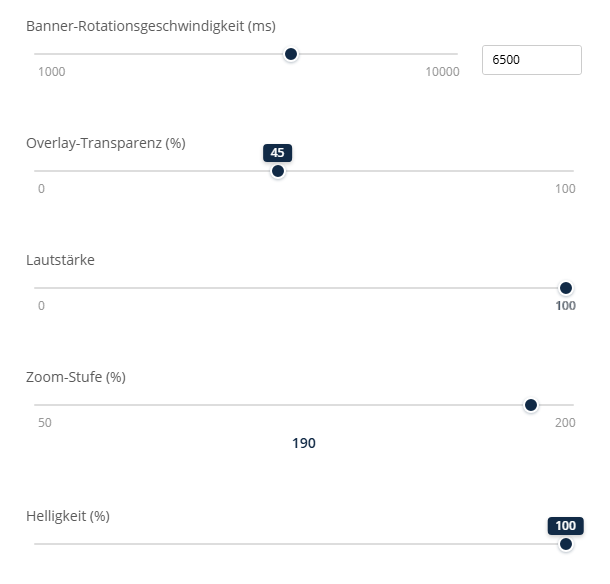

# Slider Range (Schieberegler)

Der Content Type **Slider Range** bietet ein visuelles Schieberegler-Eingabefeld zur Auswahl numerischer Werte innerhalb eines definierten Bereichs.



---

## Verwendung (Formular XML)

Der Typ `slider_range` wird folgendermaßen verwendet:

```xml
<property name="opacity" type="slider_range">
    <meta>
        <title lang="en">Opacity</title>
        <title lang="de">Deckkraft</title>
    </meta>
    <params>
        <param name="min" value="0"/>
        <param name="max" value="100"/>
        <param name="step" value="10"/>
        <param name="default_value" value="100"/>
    </params>
</property>
```

---

## Parameter

| Name            | Typ     | Standard | Beschreibung |
|-----------------|---------|----------|--------------|
| `min`           | Integer | `0`      | Der Mindestwert des Reglers. |
| `max`           | Integer | `100`    | Der Maximalwert des Reglers. |
| `step`          | Integer | `1`      | Die Schrittweite beim Verschieben. |
| `default_value` | Integer | `null`   | Der vorausgewählte Wert, falls das Feld leer ist. |
