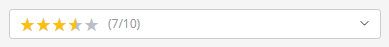
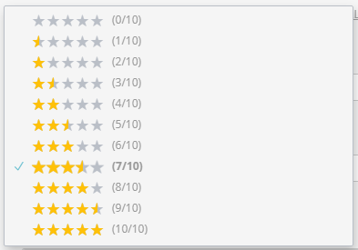
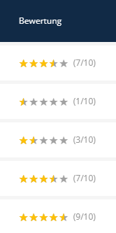

# Star Rating Feature

The **Star Rating** feature allows you to manage and visualize ratings in your Sulu application. It consists of two parts:
1. **Content Type**: For assigning ratings in the administration form.
2. **List Transformer**: For displaying ratings in the administration list view.

---

## 1. Content Type (Input)

Use the `star_rating` type in your form XML definition to allow content managers to set a rating.





### Usage

```xml
<property name="rating" type="star_rating">
    <meta>
        <title lang="en">Rating</title>
        <title lang="de">Bewertung</title>
    </meta>
    <params>
        <param name="max_value" type="expression" value="service('sulu_admin_extras.rating_selection').getMaxValue()"/>
    </params>
</property>
```
> [!IMPORTANT]
> You **must** use the expression above to fetch the `max_value` from the service. Hardcoding `value="5"` is not recommended if you want to use the global configuration.

### Parameters

| Name        | Type    | Default | Description |
|-------------|---------|---------|-------------|
| `max_value` | integer | `5`     | The maximum number of stars (scale). Only `5` or `10` are typically supported by the UI logic. |

---

## 2. List Transformer (Display)

Use the `star_rating` transformer in your list XML to visualize the rating as stars.



### Usage

```xml
<property name="rating" translation="app.rating" visibility="yes">
    <field-name>rating</field-name>
    <entity-name>object</entity-name>
    <transformer type="star_rating">
        <params>
            <param name="max_value" value="5"/>
            <param name="show_value" value="true"/>
        </params>
    </transformer>
</property>
```

### Parameters

| Name         | Type    | Default | Description |
|--------------|---------|---------|-------------|
| `max_value`  | integer | `5`     | The maximum scale used for the rating calculation. |
| `show_value` | boolean | `true`  | If `true`, displays the numeric value (e.g., `4/5`) next to the stars. |

---

## 3. Global Configuration

You can set project-wide defaults in `config/packages/sulu_admin_extras.yaml`. These defaults are used when no specific parameters are defined in the XML.

```yaml
sulu_admin_extras:
    star_rating:
        max_value: 5
        default_value: 3
        use_star_symbols: false # Use ★ / ☆ unicode symbols in dropdown select fields
```
