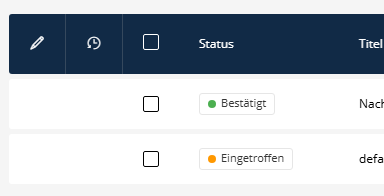
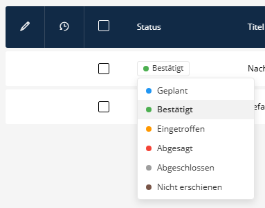
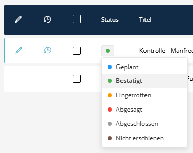

# Status Switcher List Field Transformer

Der `status_switcher` ist ein interaktiver Transformer für Listenfelder (List Field Transformer), der es ermöglicht, den Status einer Entität direkt im Sulu Datagrid (Listenansicht) zu ändern, ohne das Bearbeitungsformular öffnen zu müssen. Er wird als farbiger Punkt (optional mit Label) gerendert, der beim Anklicken ein Inline-Dropdown-Menü öffnet, aus dem ein neuer Status gewählt werden kann.





## Verwendung

In der XML-Konfiguration der Liste den `<transformer type="status_switcher">` zu der Eigenschaft hinzufügen, die das Statusfeld repräsentiert.

```xml
<property name="status" visibility="always" translation="sulu_admin.status">
    <field-name>status</field-name>
    <entity-name>dimensionContent</entity-name>
    <joins ref="dimensionContent"/>
    <transformer type="status_switcher">
        <params>
            <param name="show_name" value="true"/>
            <param name="options_api_url" value="/admin/api/my-entities/statuses"/>
            <param name="patch_api_url" value="/admin/api/my-entities/[id]/status"/>
        </params>
    </transformer>
</property>
```

### Parameter

*   `options_api_url` (string, erforderlich): Der GET-Endpunkt, um die Liste der verfügbaren Status-Optionen abzurufen.
*   `patch_api_url` (string, erforderlich): Der PATCH-Endpunkt, an den der neue Status übermittelt werden soll. Verwende `[id]` oder `{id}` als Platzhalter für die ID der Entität.
*   `show_name` (boolean/string): Standardmäßig `false`. Wenn auf `true` gesetzt, wird der Name (Titel) des ausgewählten Status neben dem farbigen Punkt angezeigt.



## Erwartete API-Formate

### 1. Options API (`options_api_url`)

**Methode:** `GET`
**Antwort:** Sollte ein JSON-Objekt mit einem `statuses`-Array zurückgeben.

```json
{
    "statuses": [
        {
            "id": "requested",
            "title": "Angefragt",
            "color": "#f2a900"
        },
        {
            "id": "confirmed",
            "title": "Bestätigt",
            "color": "#6ac86b"
        }
    ]
}
```

### 2. Patch API (`patch_api_url`)

**Methode:** `PATCH`
**Payload/Nutzdaten:** Die Komponente sendet einen JSON-Body mit der ID des ausgewählten Status:
```json
{
    "status": "confirmed"
}
```

**Antwort:** Sollte ein JSON-Objekt zurückgeben, das die aktualisierte Entität repräsentiert. Wichtig ist, dass die aktualisierten Statusfelder enthalten sind, damit die UI die Änderungen direkt korrekt anzeigen kann (dies ist v.a. nützlich, wenn das Backend z.B. spezifische Anzeigefarben diktiert).
```json
{
    "id": 123,
    "status": "confirmed",
    "typeColor": "#6ac86b",
    "typeName": "Bestätigt",
    "typeRaw": "confirmed"
}
```
