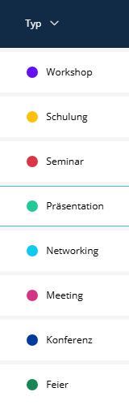

# TypeColorFieldTransformer

Ein List Field Transformer, der farbige Punkte mit optionalen Labels für kategorisierte Daten in Sulu Admin-Listen anzeigt.



## Übersicht

Der `TypeColorFieldTransformer` visualisiert kategorische Daten (wie Status, Typ, Kategorie) als farbige Punkte. Er unterstützt zwei Modi:

| Modus | Beschreibung | Backend-Code erforderlich |
|-------|--------------|---------------------------|
| **Palette-gesteuert** | Farben aus konfigurierten Paletten | Nein |
| **Backend-gesteuert** | Farben vom Backend bereitgestellt | Ja |

---

## Schnellstart (Palette-Modus)

Der einfachste Weg - kein PHP-Code erforderlich.

### 1. Farbpalette definieren

```yaml
# config/packages/sulu_admin_extras.yaml
sulu_admin_extras:
    color_palettes:
        project_status:
            draft:
                color: '#6c757d'
                name: 'app.status.draft'
            active:
                color: '#198754'
                name: 'app.status.active'
            archived:
                color: '#dc3545'
                name: 'app.status.archived'
```

### 2. Übersetzungen hinzufügen

```yaml
# translations/admin.en.yaml
app.status.draft: 'Draft'
app.status.active: 'Active'
app.status.archived: 'Archived'
```

```yaml
# translations/admin.de.yaml
app.status.draft: 'Entwurf'
app.status.active: 'Aktiv'
app.status.archived: 'Archiviert'
```

### 3. List XML konfigurieren

```xml
<property name="status" translation="app.status" visibility="always">
    <field-name>status</field-name>
    <entity-name>App\Entity\MyEntity</entity-name>

    <transformer type="type_color">
        <params>
            <param name="palette" value="project_status"/>
            <param name="show_name" value="true"/>
        </params>
    </transformer>
</property>
```

### 4. Entity-Feld muss Palette-Keys entsprechen

```php
// src/Entity/MyEntity.php
class MyEntity
{
    private string $status = 'draft';  // Muss dem Palette-Key entsprechen!
}
```

**Fertig!** Der Transformer sucht `draft` in der `project_status`-Palette und zeigt einen grauen Punkt mit "Entwurf"-Label an.

---

## Parameter

| Parameter | Typ | Standard | Beschreibung |
|-----------|-----|----------|--------------|
| `palette` | string | - | Name der zu verwendenden Farbpalette |
| `show_name` | string | `"false"` | Übersetzten Namen neben Punkt anzeigen (`"true"` oder `"false"`) |

> **Hinweis:** XML-Parameter sind immer Strings. Verwende `value="true"` nicht `value={true}`.

---

## Paletten-Konfiguration

### Kurzform (Auto-generierte Übersetzungsschlüssel)

```yaml
sulu_admin_extras:
    color_palettes:
        my_palette:
            key1: '#0d6efd'
            key2: '#198754'
```

Übersetzungsschlüssel-Format: `sulu_admin_extras.color_palettes.{palette}.{key}`

### Erweiterte Form (Eigene Übersetzungsschlüssel)

```yaml
sulu_admin_extras:
    color_palettes:
        my_palette:
            key1:
                color: '#0d6efd'
                name: 'custom.translation.key'
```

---

## Backend-gesteuerter Modus (Fallback)

Für Bundles, die ihre eigene Typ-Konfiguration bereitstellen (wie SuluEventBundle), kann der Transformer Farben aus Backend-angereicherten Listendaten lesen.

### Erforderliche Backend-Felder

Die List-Response muss diese Felder pro Item enthalten:

| Feld | Typ | Beschreibung |
|------|-----|--------------|
| `typeColor` | string | Hex-Farbcode (z.B. `"#0d6efd"`) |
| `typeName` | string | Übersetzter Anzeigename |
| `typeRaw` | string | Roh-Key für Palette-Lookup (optional) |

### Beispiel: DoctrineListRepresentationFactory

```php
use Manuxi\SuluAdminExtrasBundle\Service\ColorPaletteProvider;

class EventController
{
    public function __construct(
        private ColorPaletteProvider $colorPaletteProvider,
    ) {}

    private function addTypeInfo(array $listData): array
    {
        foreach ($listData as &$item) {
            $typeKey = $item['type'] ?? 'default';
            
            $item['typeRaw'] = $typeKey;
            $item['typeColor'] = $this->colorPaletteProvider->getColor('event_types', $typeKey);
            $item['typeName'] = $this->colorPaletteProvider->getColorName('event_types', $typeKey);
        }
        
        return $listData;
    }
}
```

### List XML (Backend-Modus)

```xml
<property name="type" translation="app.type" visibility="always">
    <field-name>type</field-name>
    <entity-name>App\Entity\Event</entity-name>

    <!-- Keine Parameter nötig - verwendet Backend-Daten -->
    <transformer type="type_color"/>
</property>
```

---

## Priorität / Fallback-Logik

Der Transformer verwendet diese Priorität:

1. **Palette-Lookup** (wenn `palette`-Parameter gesetzt)
    - Verwendet `typeRaw`-Feld wenn verfügbar, sonst rohen `value`
    - Sucht Farbe und Name aus konfigurierter Palette

2. **Backend-Daten** (Fallback wenn Palette-Lookup fehlschlägt)
    - Verwendet `typeColor`-Feld für Farbe
    - Verwendet `typeName`-Feld für Label

3. **Standard-Fallback**
    - Farbe: `#cccccc` (grau)
    - Label: Roher Feldwert

---

## Vollständiges Beispiel: Projektstatus

### Konfiguration

```yaml
# config/packages/sulu_admin_extras.yaml
sulu_admin_extras:
    color_palettes:
        project_status:
            planning:
                color: '#6c757d'
                name: 'project.status.planning'
            in_progress:
                color: '#0d6efd'
                name: 'project.status.in_progress'
            review:
                color: '#ffc107'
                name: 'project.status.review'
            completed:
                color: '#198754'
                name: 'project.status.completed'
            cancelled:
                color: '#dc3545'
                name: 'project.status.cancelled'
```

### Übersetzungen

```yaml
# translations/admin.de.yaml
project.status.planning: 'Planung'
project.status.in_progress: 'In Bearbeitung'
project.status.review: 'Überprüfung'
project.status.completed: 'Abgeschlossen'
project.status.cancelled: 'Abgebrochen'
```

### List XML

```xml
<!-- config/lists/projects.xml -->
<list xmlns="http://schemas.sulu.io/list-builder/list">
    <key>projects</key>
    <properties>
        <property name="id" visibility="no">
            <field-name>id</field-name>
            <entity-name>App\Entity\Project</entity-name>
        </property>

        <property name="title" translation="app.title" visibility="always">
            <field-name>title</field-name>
            <entity-name>App\Entity\Project</entity-name>
        </property>

        <property name="status" translation="app.status" visibility="always">
            <field-name>status</field-name>
            <entity-name>App\Entity\Project</entity-name>

            <transformer type="type_color">
                <params>
                    <param name="palette" value="project_status"/>
                    <param name="show_name" value="true"/>
                </params>
            </transformer>
        </property>
    </properties>
</list>
```

### Entity

```php
// src/Entity/Project.php
class Project
{
    public const STATUS_PLANNING = 'planning';
    public const STATUS_IN_PROGRESS = 'in_progress';
    public const STATUS_REVIEW = 'review';
    public const STATUS_COMPLETED = 'completed';
    public const STATUS_CANCELLED = 'cancelled';

    private string $status = self::STATUS_PLANNING;

    public function getStatus(): string
    {
        return $this->status;
    }

    public function setStatus(string $status): self
    {
        $this->status = $status;
        return $this;
    }
}
```

---

## Styling

Der Transformer verwendet CSS-Klassen aus `TypeColorFieldTransformer.scss`:

```scss
.typeDot {
    display: inline-flex;
    align-items: center;
    gap: 8px;
}

.typeDot::before {
    content: '';
    width: 12px;
    height: 12px;
    border-radius: 50%;
    background-color: inherit;
}

.label {
    font-size: 13px;
    color: #333;
}
```

---

## Fehlerbehebung

### Grauer Punkt wird angezeigt (Fallback-Farbe)

**Mögliche Ursachen:**
- Palette-Name in XML stimmt nicht mit Konfiguration überein
- Datenbankwert entspricht keinem Palette-Key
- Cache nicht geleert nach Konfigurationsänderung

**Lösung:**
```bash
bin/console cache:clear
bin/adminconsole sulu:admin:build
```

### Label wird nicht angezeigt

**Prüfen:**
- `show_name`-Parameter ist auf `"true"` gesetzt (String, nicht Boolean)
- Übersetzungsschlüssel existiert und ist korrekt

### Farben aus falscher Palette

**Prüfen:**
- Palette-Parameter-Wert stimmt exakt überein (Groß-/Kleinschreibung)
- Keine Tippfehler im Palette-Namen
